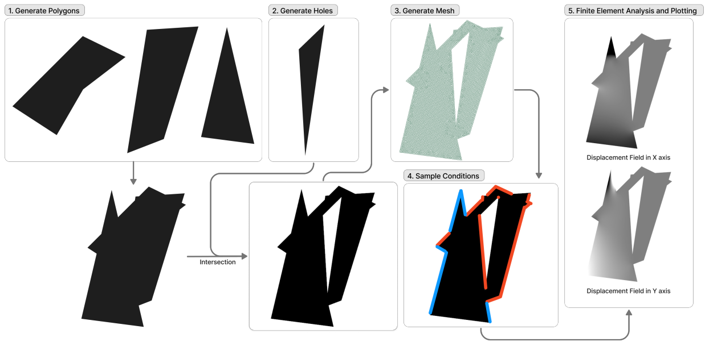
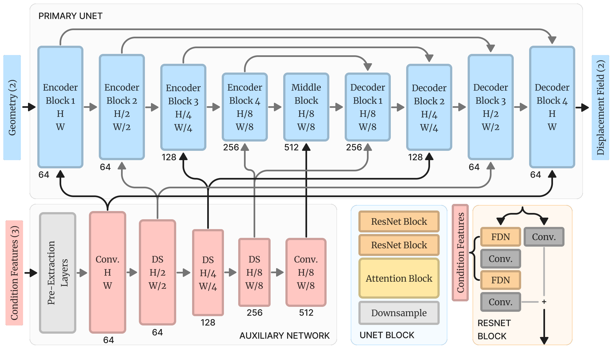

# Finite Element Analysis (FEA) with Image Generation Models
## Data Synthesis

## Model Architecture


## Abstract
Finite Element Analysis (FEA) is a widely used tool in the industry for testing and verifying component designs. However, it can be challenging to use, especially for complex geometries, and requires significant resources. Recently, Image Generation models, such as diffusion networks, have shown promise in generating high-resolution images based on spatial control prompts. We have applied an image generation model to FEA to demonstrate that it can serve as a useful alternative to the traditional FEA workflow. To achieve this, we developed a novel data synthesis pipeline that generated a dataset of 100,000 samples. We then trained a custom model architecture on this dataset, which yielded good qualitative results for most cases. Quantitative predictions were found to be restricted by the dataset’s constraints. At the current training stage, our model has a Mean Absolute Error (MAE) of 0.0144. The proposed model utilizes input images of the geometry, fixed constraints, and static loads to generate a predicted displacement field, thereby circumventing the intricacies of modeling and meshing in the finite element analysis (FEA) workflow and enabling near-instantaneous analysis.

## Setup
- Create a Conda env with python version >= 3.8
- Install shapely and sfepy via conda
```sh
conda install -c conda-forge sfepy shapely
```
- Install gmsh via pip
```sh
pip install --upgrade gmsh
```
- Install gmsh dependencies via apt-get
```sh
sudo apt-get install libglu1 libxcursor-dev libxft2 libxinerama1 libfltk1.3-dev libfreetype6-dev libgl1-mesa-dev libocct-foundation-dev libocct-data-exchange-dev
```
- Install torch and other dependencies via pip
```sh
pip install torch torchvision einops tqdm accelerate ema_pytorch jaxlib scikit-learn
```
- [Optional] To use wandb logging, install and login to wandb via
```sh
pip install wandb
wandb login
```

## Running the Code
### Data Generation
Simply run:
```sh
python generate_data.py
```
with the adequate commandline arguments. To see a list of commandline arguments, run
```sh
python generate_data.py --help
```
This creates a data folder with the following structure:
```
data
├── 1
│   ├── input.png
│   ├── 1
│   │   ├── magnitudes.txt
│   │   ├── displacement_x_0.png
│   │   ...
│   │   └── displacement_x_[num_steps].png
│   │   ├── displacement_y_0.png
│   │   ...
│   │   └── displacement_y_[num_steps].png
│   │   ├── regions_EdgeConstraint0.png
│   │   ...
│   │   └── regions_EdgeConstraintN.png
│   │   ├── regions_EdgeConstraint0.png
│   │   ...
│   │   └── regions_EdgeConstraintN.png
│   │   ├── regions_VertexConstraint0.png
│   │   ...
│   │   └── regions_VertexConstraintN.png
│   │   ├── regions_VertexForce0.png
│   │   ...
│   │   └── regions_VertexForceN.png
│   ├── 2
│   │   ...
│   ├── ...
│   └── [num_conditions_per_plate]
├── 2
│   ...
├── ...
└── [num_plates]
```

### Sampling Model
First, ensure there is a data folder with the above mentioned structure. Additionally, ensure there exists a [results_dir] folder with a model checkpoint folder (not the .zip).
Then, run the following with the adequate command line arguments (--help for a list of arguments):
```sh
python sample_model.py [--data_dir DATA_DIR] [--sample_data_dir SAMPLE_DATA_DIR] [--num_sample_conditions_per_plate NUM_SAMPLE_CONDITIONS_PER_PLATE] [--num_steps_per_sample_condition NUM_STEPS_PER_SAMPLE_CONDITION] [--results_dir RESULTS_DIR] [--image_size IMAGE_SIZE] [--batch_size BATCH_SIZE] [--num_gradient_accumulation_steps NUM_GRADIENT_ACCUMULATION_STEPS] --checkpoint CHECKPOINT [--use_ema_model] [--milestone MILESTONE]
```
This will create a folder with the name [milestone] provided in the provided [results_dir] directory.

### Calculating Accuracy
First, generate a sample dataset using the above mentioned method and --save_meshes turned on. This will result in a data folder with [num_steps] * 2 .vtk files per condition in addition to the abovementioned structure. Then, run the following with the adequate command line arguments (--help for a list of arguments):
```sh
python calculate_accuracy.py [--ground_truth_data_dir GROUND_TRUTH_DATA_DIR] [--generated_samples_dir GENERATED_SAMPLES_DIR] [--num_plates NUM_PLATES] [--num_conditions_per_plate NUM_CONDITIONS_PER_PLATE] [--num_steps_per_condition NUM_STEPS_PER_CONDITION] [--image_size IMAGE_SIZE]
```

### Training Model
First, ensure there is a data directory generated with the above mentioned structure. Then, run the following with the adequate command line arguments (--help for a list of arguments):
```sh
python train_model.py [--data_dir DATA_DIR] [--sample_data_dir SAMPLE_DATA_DIR] [--num_sample_conditions_per_plate NUM_SAMPLE_CONDITIONS_PER_PLATE] [--results_dir RESULTS_DIR] [--image_size IMAGE_SIZE] [--batch_size BATCH_SIZE] [--num_gradient_accumulation_steps NUM_GRADIENT_ACCUMULATION_STEPS] [--num_steps NUM_STEPS] [--num_steps_per_milestone NUM_STEPS_PER_MILESTONE] [--ema_steps_per_milestone EMA_STEPS_PER_MILESTONE] [--learning_rate LEARNING_RATE] [--loss_type LOSS_TYPE] [--checkpoint CHECKPOINT] [--use_wandb] [--wandb_project WANDB_PROJECT] [--wandb_restrict_cache WANDB_RESTRICT_CACHE]
```
Ensure [num_gradient_accumulation_steps] * [batch_size] >= 16, and that the data folder contains a minimum of 100 total samples (= [num_plates] * [num_conditions_per_plate] * ([num_steps] - 1)).

### Utility Notebooks
Note that all notebooks must be first moved to the root directory of the project before running.
- [Application Specific Model Sampling](test_nbs/generateapplication.ipynb): This notebook can be used to generate samples for a specific application. It requires a trained model checkpoint and a data folder containing application specific SfePy python file as well as the mesh file for the application.
- [Calculate Application Specific Metrics](test_nbs/applicationmetrics.ipynb): This notebook can be used to calculate the metrics for a specific application. It requires a application folder containing the ground truth displacement field .vtk files, ground truth geometry image file and the predicted displacement field image files.
- [Data Visualization](test_nbs/test_db.ipynb): This notebook can be used to visualize the data generated by the data generation script.
- [Model Testing](test_nbs/test_model.ipynb): This notebook can be used to find the number of model parameters, and test if the model trains properly.
- [Convert Model Prediction Image to Mesh](test_nbs/save_pred_disp_mesh.ipynb): This notebook can be used to convert the model prediction images back into mesh files to be used with SfePy.
- [Sample Model](test_nbs/sample_model.ipynb): This notebook can be used to sample the model for a single sample manually provided.
- [Plot Logs](test_nbs/plot_logs.ipynb): This notebook can be used to plot the logs generated by the training script.