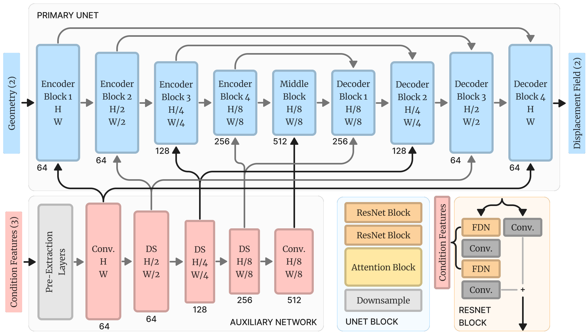

### FEA with Generative Models


### Setup
- Create a Conda env with python > 3.8
- Install shapely and sfepy via conda
  ```sh
  conda install -c conda-forge sfepy shapely
  ```
- Install gmsh via pip
  ```sh
  pip install --upgrade gmsh
  ```
- Install gmsh dependencies via apt-get
  ```sh
  sudo apt-get install libglu1 libxcursor-dev libxft2 libxinerama1 libfltk1.3-dev libfreetype6-dev libgl1-mesa-dev libocct-foundation-dev libocct-data-exchange-dev
  ```
- Install torch and other dependencies via pip
  ```sh
  pip install torch torchvision einops tqdm accelerate ema_pytorch jaxlib wandb
  ```
- [Optional] To use wandb logging, login to wandb via
  ```sh
  wandb login
  ```
- Run [main.py](main.py)!
